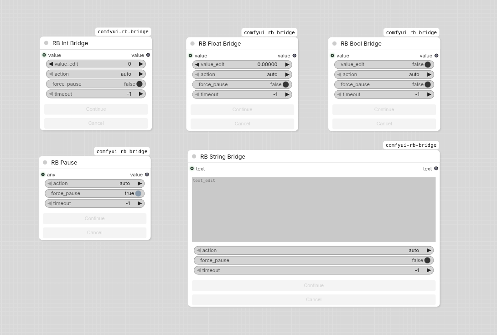

# ComfyUI Bridge

A collection of pause-and-edit nodes for ComfyUI that let you interrupt workflow execution, inspect and modify values, then continue.



## Nodes

### Bridge Nodes (editable)

These nodes pause execution and allow you to edit the value before continuing.

| Node | Type | Input | Edit Widget | Output |
|------|------|-------|-------------|--------|
| **RB String Bridge** | STRING | multiline text | multiline text | edited text |
| **RB Int Bridge** | INT | number input | number input | edited number |
| **RB Float Bridge** | FLOAT | number input | number input | edited number |
| **RB Bool Bridge** | BOOLEAN | boolean | toggle | edited boolean |

### RB Pause (passthrough)

A pure passthrough node that pauses execution without editing. Useful for inspecting intermediate results at any point in the workflow. Accepts and outputs any type (`*`).

| Input | Type | Description |
|-------|------|-------------|
| `any` | `*` | Any value to pass through |
| `force_pause` | BOOLEAN | When `true`, forces the node to pause every time the workflow is queued, even if the input hasn't changed |

## Parameters

All nodes share these parameters:

| Parameter | Default | Description |
|-----------|---------|-------------|
| `timeout` | 0 | Seconds to wait. `0` = infinite, `-1` = skip pause entirely, `>0` = auto-continue after N seconds |

## How It Works

1. **Execution reaches the node** — the workflow pauses and the backend sends an event to the frontend
2. **Buttons activate** — Continue and Cancel become clickable (they are grayed out otherwise)
3. **Edit (Bridge nodes only)** — modify the value in the `value_edit` / `text_edit` widget directly on the node
4. **Continue** — click Continue to resume with the edited value
5. **Cancel** — click Cancel to interrupt the entire workflow

## Installation

```bash
cd ComfyUI/custom_nodes
git clone https://github.com/itribs/comfyui-rb-bridge.git
```

## License

MIT